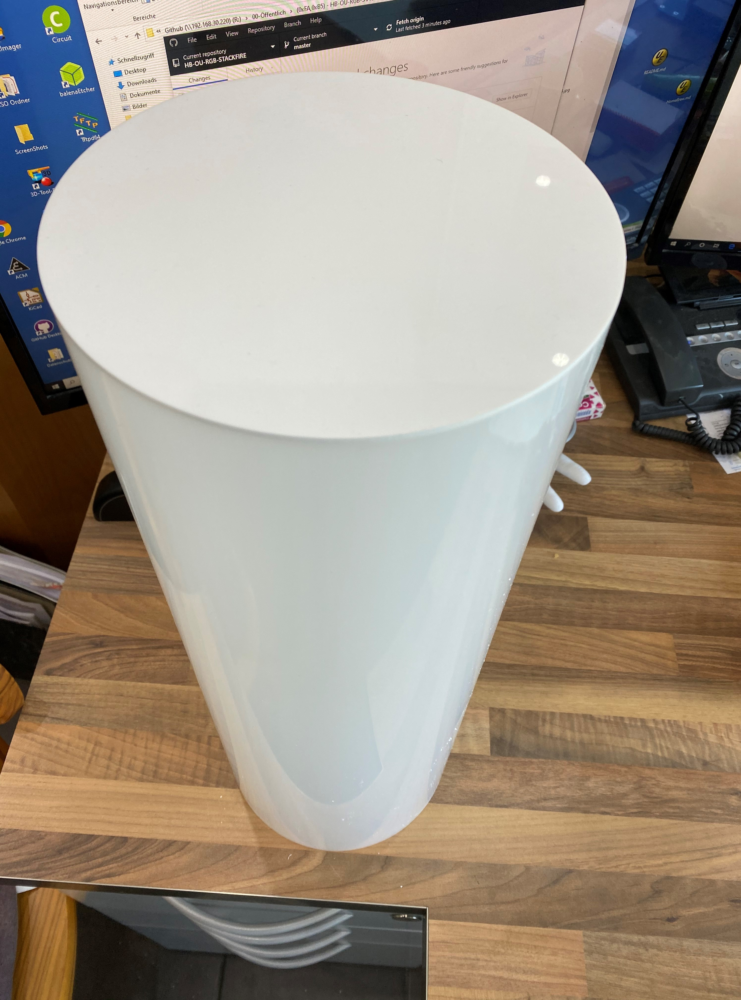

# HB-OU-RGB-STACKFIRE - Kaminfeuer Leuchte

Viele Projekte haben sich mit der Steuerung von WS2812B-LED's befasst. 
Eigentlich wollte ich aus dem Tee-Licht-Projekt vom [pafra-123](https://github.com/pafra-123/HB_LED_Teelicht) einen kleinen Kamin für die Weihnachtskrippe machen.
Daraus enstand der Gedanke an eine etwas größere Kamin-/Lagerfeuer-Simulation. 
Irgendwo fand ich dann das Projekt einer Nachttischlampe.
Im Großen und Ganzen ganz hübsch, mir jedoch zu klein. Ich wollte es als Raumdeko, als Hingucker bei der Gartenparty und als gemütliches Highlight abends vor dem Wohnwagen. Und ich wollte es Homematic-gebunden haben. Da fand ich den [RGB-Controler](https://github.com/jp112sdl/HB-UNI-RGB-LED-CTRL) von Jérôme(jp112sdl). 
So verschmolzen Teile diverser Projekte zu einem Neuen.

## Bilder

## Konfiguration
### auf der Platine
Die aktuelle Version der PCB verfügt über einen 2-fach Jumper J4 (VCC). Dieser ermöglicht es, die Leuchte ohne das [AZDelivery 5 x 220V zu 5V Mini-Netzteil](https://www.amazon.de/gp/product/B07V7GHK51/ref=ppx_yo_dt_b_asin_title_o06_s00?ie=UTF8&psc=1) zu betreiben. Die Schaltung wird dann über das erste Netzteil der Stripes mit versorgt.
:exclamation:Die Jumper dürfen auf keinen Fall gesteckt werden, wenn das Mini-Netzteil auf der Platine verbaut ist.
Mit dem Einsatz des Mini-Netzteiles habe ich die Möglichkeit, über den im Boden eingauten Schalter, die Netzteile der LED's abzuschalten, ohne dabei den Mega2560 vom Netz zu nehmen. Es kommen somit keine Servicemeldungen über ein "nicht erreichbares Gerät"

### im SourceCode
Die Leuchte ist so geplant, dass sie entwerder mit 10 Stripes á 30LED's oder mit 20 Stripes á 30LED's bestückt werden kann.
Die beiden Netzteile im Grundgehäuse versorgen jeweils immer jeden 2. Ausgang. 
Das Grundgehäuse hat für die Befestigung der Netzteile entsprechende Bohrungen(Abstandshalter).  

In Zeile 20 muss bei voller Bestückung der Paramter  #define doubleLED  gesetzt werden.  Bei halber Bestückung entsprechend auskommentieren.  

Die Zeilen 30-75 definieren die Anzahl der LED's je Stripe sowie die entsprechenden Ports der Arduino Mega 2560 Core.  

In den Zeilen 88-117 kann das Verhalten des FireProgramm's in Intensität (Sparking) und Flammenhöhe (Cooling) nach Bedarf angepasst werden.
Derzeit sind nur die letzten 3 Programme (Lagerfeuer, Wasserfall, TV-Simulation) als Feuer verknüpft. 
siehe: RGBCtrl.h Zeile 748-772 RGBProgramFire1(brightness,"1-6");  

In den Zeilen 123-144: FastLED liefert von Haus aus diverse Farbpaletten mit. Für ein Lagerfeuer haben sich bisher Nr.10 (HeatColors_p) oder Nr.11 (LavaColors_p) bewährt.  

## Schaltplan

[:arrow_right: Schaltplan](Images/PCB_HB-OU-RGB-STACKFIRE/Schaltplan_HB-OU-RGB-STACKFIRE-V2.pdf)

## Platine

[:arrow_right: PCB Gerber](Platine/HB-OU-RGB-STACKFIRE(Mega2560)-V2/HB-OU-RGB-STACKFIRE-V2.zip)

## Gehäuse

Das Gehaäuse ist ein 3D-Druck. Auf Grund der Größe ist hier mindestens ein Druckbereich von 220x220x200 erforderlich.
(ANET A8/A6/A10 o.ä).
Der Sockel besteht auf dem [Grundgehäuse](Gehäuse/Stack-Fire-Leuchte_Sockel_V1.stl) und der [Auflageplatte](Gehäuse/Stack-Fire-Leuchte_Sockel_Platine_V1.stl) für de Platine.
Desweiteren werden noch 2 Abschlussdeckel [oben](Gehäuse/Stack-Fire-Leuchte_Deckel_ALU_oben_V1.stl) und [unten](Gehäuse/Stack-Fire-Leuchte_Deckel_ALU_unten_V1.stl) für das AluRohr benötigt. 
Ich nutze zum drucken PETG. 

## Aufbau / Stückliste

### Der Aufbau

Grundgehäuse mit Netzteilen 

Auflage für die Platine 

Einbau der Auflage mit Verschraubung des Rohrhalters 

Rohrdeckel mit Verschraubung 

Montage des Alurohrs (dieses wird vor Anbringen der LED-Stripes komplett mit dem Wärmeleitklebeband beklebt 

Rohr mit voller Bestückung 20x30LED 

Testaufbau Teil 1 

Testbaubau Teil 2 

Testaufbau Teil 3 

Das Plexiglasrohr. Dieses wird am Ende einfach auf das Grundgehäuse gesteckt und kann bei Bedarf mit 4 Schrauben fixiert werden. 

Der passende Deckel kann direkt mit bestellt werden. Er ist so gefrässt, dass er passgenau auf das Rohr geklebt werden kann 

Prototype der WS2812B-Protect Platine. Diese wird nach der Bestückung direkt an den Stripe gelötet. Als Steckverbinder habe ich von gewinkelten Pinleisten (Raster 2.54) einfach die Stifte einzeln genommen. Ist viel Fummelei...  

### Die benötigten Bauteile
| Bauteil | Link |
| --------|------|
|50cm Alurohr Länge: 0,5-3 m Aluminium Rohr Alu Profil Rundrohr AlMgSi0,5 Modellbau | [:arrow_right: Ebay](https://www.ebay.de/itm/Alurohr-L%C3%A4nge-0-5-3-m-Aluminium-Rohr-Alu-Profil-Rundrohr-AlMgSi0-5-Modellbau/222169076786?ssPageName=STRK%3AMEBIDX%3AIT&var=521010583605&_trksid=p2057872.m2749.l2649) |
|55cm  PLEXIGLAS® XT Rohr 3mm weiß 200/194mm Durchmesser | [:arrow_right: Ebay](https://www.ebay.de/itm/PLEXIGLAS-XT-Rohr-3mm-wei%C3%9F-200-194mm-Durchmesser-74-00-lfdm/112415674967?ssPageName=STRK%3AMEBIDX%3AIT&var=412812679722&_trksid=p2057872.m2749.l2649) |
|PLEXIGLAS® Deckel 4 mm weiß Ø freiwählbar passend für unsere PLEXIGLAS® XT Rohr | [:arrow_right: Ebay](https://www.ebay.de/itm/PLEXIGLAS-Deckel-4-mm-wei%C3%9F-%C3%98-freiw%C3%A4hlbar-passend-f%C3%BCr-unsere-PLEXIGLAS-XT-Rohre/122355660437?ssPageName=STRK%3AMEBIDX%3AIT&var=422838977364&_trksid=p2057872.m2749.l2649)|
|WS2812B-Protect | [:arrow_right: Reichelt Bestell-Liste](https://www.reichelt.de/my/1667564) |
|Limeow Thermisch Klebeband Wärmeleitendes Doppelseitiges Klebeband Selbstklebend Tape Wärmeleitpaste Thermal Compound Thermische Verbindung Paste Kühlkörper Leitfähiges Kühlband Doppelseitig Klebend | [:arrow_right: Amazon](https://www.amazon.de/gp/product/B07FPKVML7/ref=ppx_yo_dt_b_asin_title_o05_s00?ie=UTF8&psc=1) |
|AZDelivery 5 x 220V zu 5V Mini-Netzteil für Arduino und Raspberry Pi | [:arrow_right: Amazon](https://www.amazon.de/gp/product/B07V7GHK51/ref=ppx_yo_dt_b_asin_title_o06_s00?ie=UTF8&psc=1) |
|MW LRS-150F-5 Schaltnetzteil, geschlossen, 110 W, 5 V, 22 A | [:arrow_right: Reichelt](https://www.reichelt.de/schaltnetzteil-geschlossen-110-w-5-v-22-a-mw-lrs-150f-5-p202979.html?&nbc=1)|
| | |
|Bauteileliste Reichelt (incl. der benötigten Netzteile)| [:arrow_right: Reichelt](https://www.reichelt.de/my/1677743)|

## Hinweise

- :exclamation: Viele Projekte verweisen auf Probleme mit dem WS2812B. Die Schutzschaltung WS2812B-Protect ist eine kleine 17x10mm Platine, welche die Stripes schützen soll. Sie ist je nach eigenem Ermessen einbaubar. 

## CCU2/CCU3/RaspberryMatic Installation

Einstellungen/Systemsteuerung/Zusatzsoftware -> Datei 

Ich nutze das AddOn von Jérôme (jp112sdl) [JP-HB-Devices-addon](https://github.com/jp112sdl/JP-HB-Devices-addon).
In dieses bzw. dessen Struckture müssen die Dateien aus dem Verzeichniss [AddOn](AddOn) entsprechend selbst eingebunden werden und das AddOn dann installiert werden.

## Benötige Libraries

 - [FastLED](https://github.com/FastLED/FastLED)
 - [AskSinPP](https://github.com/pa-pa/AskSinPP)
   - sowie die dort aufgeführten [zusätzlichen Bibliotheken](https://github.com/pa-pa/AskSinPP#required-additional-arduino-libraries)

## Lizenz

**Creative Commons BY-NC-SA** 
Give Credit, NonCommercial, ShareAlike

 This work is licensed under a <a rel="license" href="http://creativecommons.org/licenses/by-nc-sa/4.0/">Creative Commons Attribution-NonCommercial-ShareAlike 4.0 International License</a>.
